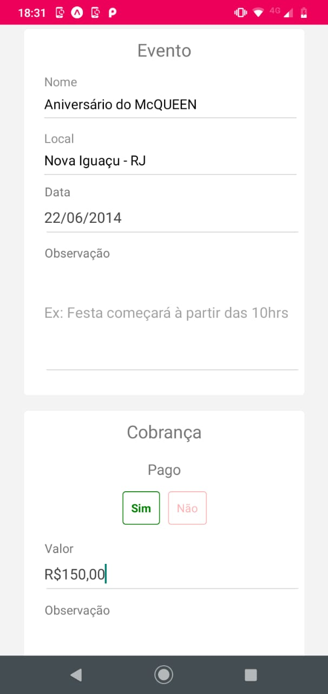
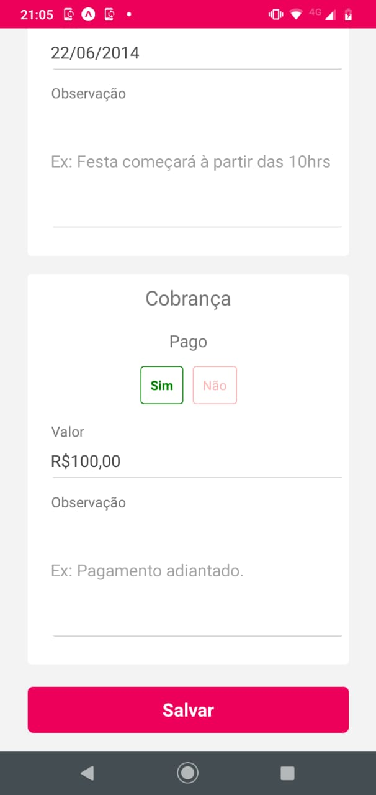

<h1 align="center">
  Projeto Decorar Arte Festas e Eventos
</h1>

 
  

    
    
    
    
    
    
  

 

## 📛 Tecnologias

Esse projeto foi desenvolvido com as seguintes tecnologias:

- React
- React-Native
- Expo
- Redux
- Styled Components
- Java Spring Boot
- JPA
- MySql
- Tomcat
- Amazon Cloud

## 🧠 Projeto

Necessidade do Cliente, ter um app para controlar e administrar os eventos realizados, ter um histórico dos eventos.

 

  <h1 align="center">
  Documentação da API
</h1>
 
  

  Base url:

  

  http://3.17.4.232:8080/decorarte/api

 

## GET - Lista todos os eventos.

/evento

return BODY:

[
  {
        "id": int,
        "tipoServico": int,
        "nomeCliente": string,
        "telefoneCliente": string,
        "nomeEvento": string,
        "localEvento": string,
        "dataEvento": date,
        "observacaoEvento": string,
        "pagoCobranca": boolean,
        "valorCobranca": double,        
        "observacaoCobranca": string,
        "imagem": string (base64)
    }
]

 

## GET - Buscar um evento por id. 

/evento/buscar?id=ID

return BODY:

[
  {
        "id": int,
        "tipoServico": int,
        "nomeCliente": string,
        "telefoneCliente": string,
        "nomeEvento": string,
        "localEvento": string,
        "dataEvento": date,
        "observacaoEvento": string,
        "pagoCobranca": boolean,
        "valorCobranca": double,        
        "observacaoCobranca": string,
        "imagem": string (base64
    }
]

 

## POST - Buscar um evento por id. 

/evento/salvar

return BODY:

[
  {
        "id": int,
        "tipoServico": int,
        "nomeCliente": string,
        "telefoneCliente": string,
        "nomeEvento": string,
        "localEvento": string,
        "dataEvento": date,
        "observacaoEvento": string,
        "pagoCobranca": boolean,
        "valorCobranca": double,        
        "observacaoCobranca": string,
        "imagem": string (base64)
    }
]

 

## POST - Apaga um evento por id. 

/evento/apagar

id: ID

return HEADER:

 header.mensagem = Apagado com sucesso! || Error ao apagar!
 header.result = true || false
 
  
  
